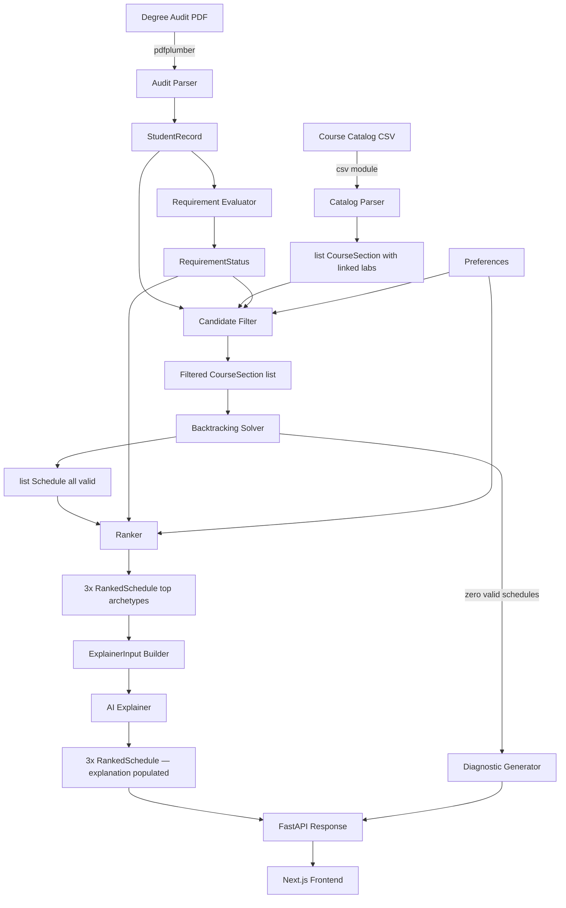

# Academic Planning Engine — Implementation Baseline

**Last updated:** 2026-07-21  
**Status:** Approved for implementation

---

## 1. Executive Summary

The Academic Planning Engine is a single-page web application that accepts a Swarthmore Degree Works audit PDF and the Swarthmore course catalog CSV, then generates ranked, valid semester schedules tailored to the student's remaining graduation requirements and personal preferences.

The core engine is entirely deterministic. Algorithms decide which schedules are valid, which requirements they satisfy, and how to rank them. A language model is invoked only at the end of the pipeline to translate structured results into plain English explanations.

Version 1 supports **Swarthmore College only**. The architecture isolates Swarthmore-specific parsing and requirement definitions so the core engine can be reused for additional institutions later.

**Target timeline:** One month with Claude Code as implementation partner.  
**Feasibility:** High. The catalog contains 310 rows of `Course Type == "Course"` and approximately 469 total parent sections when all supported parent types are included (Course, FY Seminar, Language Course, Seminar1, Studio Course, Workshop). The audit is machine-generated with consistent structure, and the scheduling problem for a single semester is well within the capacity of a backtracking search.

---

## 2. Final MVP Scope

### Included in Version 1

- Degree Works PDF parsing (pdfplumber)
- Course catalog CSV parsing with full normalization
- Student record and requirement status derived from parsed audit
- Time conflict detection (hard constraint)
- Credit limit enforcement (hard constraint, configurable target)
- Already-completed course exclusion
- Preregistered course awareness (lock-in or override)
- Linked section constraints (labs and drills required when parent course is selected)
- Swarthmore CS major remaining requirement evaluation
- Swarthmore distribution and writing requirement evaluation via course attributes
- Backtracking schedule generator with incremental pruning
- Three categorically distinct ranked schedule recommendations
- User preferences: credit range, free days, earliest start, latest end, preferred subjects, excluded courses
- Structured diagnostic output when no valid schedule exists
- Claude API explanation layer (one paragraph per recommendation)
- FastAPI backend
- Next.js / TypeScript / Tailwind frontend with upload, preview, configuration, and results views
- Deployment to Railway (backend) + Vercel (frontend)

### Excluded or Deferred from Version 1

- Multi-semester or four-year planning
- Grade-based prerequisite enforcement (prerequisite text displayed as a warning only; student confirms eligibility)
- Physical education tracking (zero-credit, specialized counting rules, out of scope)
- PHED and DANC_P courses in schedule recommendations
- User accounts, session persistence, or database
- Multi-university support
- Honors requirements (Degree Works notes they are not available in the system)
- Professor ratings or historical grade data
- Calendar export (ICS, Google Calendar)
- Variable-credit course handling beyond the listed default credit value
- Double-major planning
- Advisor dashboard or shared sessions

---

## 3. Primary User Flow

**Step 1 — Upload**  
User uploads their Swarthmore Degree Works audit PDF and the Fall 2026 course catalog CSV. The system validates both files before proceeding.

**Step 2 — Audit Summary**  
System displays parsed student profile: name, major, class year, credits applied vs. required, and a requirement status table showing which blocks are complete and which remain. Preregistered courses are listed with an option to lock them in or treat them as suggestions.

**Step 3 — Preferences**  
User configures:
- Credit target (minimum and maximum, default 3–4)
- Days to keep free (e.g., no Friday classes)
- Earliest class start time
- Latest class end time
- Preferred subjects (boosts ranking, not a hard constraint)
- Courses to explicitly exclude

**Step 4 — Generation**  
System filters the catalog to eligible courses, runs the backtracking solver, scores all valid schedules against requirement coverage and preferences, and selects the three most distinct archetypes. Expected runtime: under 10 seconds.

**Step 5 — Results**  
Three recommended schedules are displayed, each with:
- Calendar view showing meeting times across the week
- Total credits
- List of remaining requirements this schedule advances
- Score breakdown (requirements, preferences, balance)
- AI-generated explanation paragraph

**Boundary case — Student is already at credit maximum**  
If locked preregistered credits already meet or exceed `max_credits`, the solver is not run. Instead, the system evaluates the preregistered courses directly against the remaining requirements and returns them as a single "current registration" result. The results page shows which requirements the existing registration addresses, which remain open, and a note: "Your current registration accounts for the full credit load. No additional courses were generated." This path is detected before candidate filtering runs.

**Failure path — No valid schedule**  
If no schedule satisfies all hard constraints, the system displays a structured diagnostic: which constraints caused the failure, which requirement cannot be met from current offerings, and specific suggestions for which preferences to relax.

**Validation failures**  
- Wrong file type → rejected at upload with specific error
- Catalog CSV from a different semester → warning, allow override
- PDF not recognized as a Degree Works audit → rejected with instructions

---

## 4. Source Data Assessment

### Degree Audit — `degreeauditexample.pdf`

**Source:** Swarthmore Degree Works, exported as PDF. The file is machine-generated by Ellucian Degree Works software and has a consistent, predictable structure.

**Student profile in the example file:**
- Class Year 2027, CS major, Catalog Year 202304
- Credits: 32 required, 31.5 applied (including in-progress)
- Overall degree progress: 86%
- Preregistered for Fall 2026: CPSC 063 (AI), ENGR 028 (Mobile Robotics), ENGR 053 (Inclusive Engineering Design), PHYS 005 (Particles & Waves), PHED 002A, PHED 002B — four academic credits already committed

**Incomplete requirements in the example:**
1. **Minimum credits:** 0.5 more credit needed
2. **Distribution — Writing:** needs one HUW or NSW course (Social Sciences writing already satisfied; Humanities and NS writing still needed; need one of the two)
3. **Physical Education:** 4 units required in PHED or DANC_P
4. **CS Major — Intro to Computer Systems:** CPSC 031 taken with CR grade; CS majors require minimum C letter grade, so the requirement is not satisfied despite completing the course
5. **CS Major — 8 Required Credits in CPSC:** 2 more CPSC credits needed
6. **CS Major — Senior Comprehensive:** CPSC 099 not yet taken

**Critical parsing observation — grade-based requirement split:**  
CPSC 031 appears in the completed courses list (CR grade, Fall 2023) and counts toward the NS distribution requirement. However, the CS major section marks "Intro to Computer Systems" as INCOMPLETE because CS majors must earn a minimum C letter grade, not CR. The same course code can satisfy one requirement block and fail another based on grade. The parser must capture grades, and requirement evaluation must distinguish grade thresholds per requirement context.

**Parseable with high confidence:**
- Student name, ID, degree, major, class year, catalog year, audit date
- Credit totals (required and applied)
- Requirement block headers with COMPLETE / INCOMPLETE status
- Course tables: code, title, grade, credits, term (completed and in-progress)
- Preregistered courses section
- Additional courses section
- Exceptions table (registrar overrides)

**Parseable with moderate confidence:**
- "Still needed" text per incomplete requirement block (semi-structured natural language)
- Writing sub-requirement completion status by division

**Not parsed in MVP:**
- AP credit substitution details (shows as "NO TRANSCRIPT DETAI - Advanced Placement" in DW)
- Exact course set definitions for CS elective groups (encoded in the still-needed text, not a structured table)
- Grade threshold notes embedded in requirement descriptions

**Privacy:** The example PDF contains real student PII. Do not commit this file to version control. All test fixtures must use anonymized or synthetic data.

---

### Course Catalog — `fall_2026.csv`

**Source:** Swarthmore College official Fall 2026 course schedule export dated 7/20/2026.

**Structure:** 862 rows total.
- Row 1: Metadata (`"Fall 2026","Swarthmore College Course Schedule",,,export timestamp`) — skip
- Row 2: Column headers — use as field names
- Rows 3–862: Section data (860 sections)

**Section counts by type:**
- Course (parent, schedulable): 310
- Lab: 95
- Drill: 11
- Attachment: 4
- Other (Seminar1, Seminar2, Language Course, Studio Course, FY Seminar, Research Project, Thesis, Directed Rdg, Workshop, Performance, Phys Educ): ~240

**Column definitions:**

| Column | Name | Notes |
|--------|------|-------|
| 1 | Crs Ref No | Unique numeric section ID. Use as primary key. |
| 2 | Subj | Subject code (CPSC, MATH, ENGL, etc.) |
| 3 | Num | Course number. **Excel formula format: `="035"`** — must strip `="` prefix and `"` suffix. |
| 4 | Sec | Section identifier. **Same Excel formula format for numeric sections.** Letter sections (A, B, MA) appear as plain letters. |
| 5 | Course Title | Abbreviated. Full title in the last column. |
| 6 | Cr | Credits. Numeric. **Empty for labs and drills** — treat as 0. Values observed: 0, 0.5, 1, 1.5, 2. |
| 7 | Dist | Distribution attributes. **Comma-separated, quoted field.** Examples: `SS`, `"HU, W"`, `"NS, NSEP"`, `"FYS, SS, W"`. Empty for labs. |
| 8 | Enr Lim | Enrollment limit. Often empty. |
| 9 | Instructor(s) | Format: `"Last,First (email)"`. Multiple instructors comma-separated within the field. Often empty for labs. |
| 10 | Course Type | Determines parent/child role. See type handling below. |
| 11 | Days | Day letter codes: M T W R F. Combinations concatenated: `MWF`, `TR`. **Multiple meeting times** use comma-separated values matching the Times column: `"M,M"`. |
| 12 | Times | `10:30am-11:20am` format. Comma-separated for multi-meeting courses matching Days. Empty for some special sections. |
| 13 | Bldg & Room | Location. Comma-separated for multi-meeting. Can be `"Off Campus "`. |
| 14 | note | Free text. Contains cross-listing info, enrollment restrictions, required linked sections, eligibility markers. |
| 15 | (unnamed) | Search index string concatenating course identifiers. Ignore. |

**Normalization rules:**

1. **Excel formula stripping:** For fields 3 and 4, if value starts with `="`, extract the string between the quotes: `="035"` → `035`.

2. **Distribution attribute parsing:** Split on `, `. Derive composite writing attributes:
   - `["HU", "W"]` → add `HUW` to the effective attribute set
   - `["NS", "W"]` or `["NS", "NSEP", "W"]` → add `NSW`
   - `["SS", "W"]` → add `SSW`
   - Plain `["W"]` → add `NDW` (non-divisional writing; can satisfy the "any division" writing slot)
   Keep the original codes as well.

3. **Multi-meeting time parsing:** If Days contains a comma (e.g., `"M,M"`), split both Days and Times on comma and produce one `MeetingTime` object per pair.

4. **Time parsing:** Convert 12-hour strings to `datetime.time` objects. Handle: `10:30am`, `01:15pm`, `07:00pm`, `08:00pm`. Pad single-digit hours.

5. **Credits:** If the Cr field is empty or blank, assign `Decimal("0")`. Do not convert credits to float; use `Decimal` throughout to avoid drift when summing.

6. **Instructor parsing:** Split on `","` but keep awareness that Last,First is comma-separated internally. Best approach: extract email addresses as the reliable separator; everything before the first email is the name.

7. **Parent/child linking:** After parsing all rows, group by `(Subj, Num)`. Within each group, rows with Course Type `Lab`, `Drill`, or `Attachment` are children of the row(s) in the same group with Course Type `Course`, `Language Course`, `Studio Course`, or `FY Seminar`. A parent section's `linked_sections` list contains all its child options.

**Special cases requiring attention:**

- **Double-graded seminars** (e.g., ANTH 122 A and B, ENGL 121 A and B): Both `Seminar1` and `Seminar2` sections are required simultaneously. Note field says "Double-graded seminar. Both sections required." These meet at the same time, so they do not conflict with each other. For the solver: treat the Seminar1+Seminar2 pair as a single atomic course selection (both rows enter the schedule together, counting their credits once).

- **CPSC 031 enrollment restriction:** Note says "2027-2028 Students ONLY." Assumption: this includes Class of 2027, which is the demo student's class year. Flag as a warning in the UI but do not exclude the course.

- **CPSC 099 (Senior Comprehensive):** Course Type is `Research Project`, no meeting times. Note says "All senior majors will be registered." Do not include in schedule generation. Flag as auto-registered in the requirement status display.

- **PHED and DANC_P sections:** Course Type `Phys Educ`. Exclude entirely from schedule generation candidates.

- **Language Course + Drill pairs:** The parent Language Course carries credits; the drill adds zero credits but is mandatory. Link drills to their Language Course parent. When the parent is selected, one drill section must also be chosen, and the drill's meeting time must not conflict.

- **Variable credit courses** (EDUC 161: "May be taken for 1 or 2 credits"): Use the listed `Cr` value (1) without special handling.

- **Courses with no meeting times:** Thesis, Directed Reading, Research Project types have empty Days/Times. Exclude from schedule generation.

- **Missing instructors:** Valid data state. Do not fail parsing. Store as empty list.

---

## 5. Architectural Decisions

### Decision 1 — Degree Works as Source of Truth for Completed Requirements

**Chosen:** Trust Degree Works for what is already satisfied. Do not re-implement Swarthmore's full requirement evaluation logic from scratch.

**Rationale:** The audit already tells us which requirement blocks are COMPLETE, which are INCOMPLETE, and which courses have been applied to which blocks. Re-deriving this independently would require coding every Swarthmore rule (complex, error-prone, and untestable without many student examples). Degree Works has already done this computation. We parse its output.

**What we do instead:** Parse the audit to extract:
- All completed requirement blocks (with their applied courses)
- All incomplete requirement blocks (with "still needed" text)
- The specific remaining items we can evaluate (see Section 9)

**What we hard-code:** The remaining CS major and distribution requirement rules as structured Python definitions — not a general rule engine, just the specific incomplete items that the demo student and typical CS students face. These definitions are in `adapters/swarthmore/requirement_defs.py`.

**Rejected alternative:** Full independent requirement engine. Too much work for MVP and creates a parallel system that can diverge from Degree Works.

---

### Decision 2 — Degree Audit Input Format: PDF Only

**Chosen:** Parse the Degree Works PDF using `pdfplumber`.

**Rationale:** The only file available is a PDF. Degree Works generates these programmatically from a consistent template. The structure (section headers, tabular course lists, status labels) is machine-generated and repeatable. `pdfplumber` handles Degree Works PDFs reliably with its table extraction and text-block layout parsing.

**Rejected alternative:** Ask users to export a separate CSV. Degree Works does not offer a standard CSV export for the full audit, and asking users for two audit formats adds friction with no current benefit.

---

### Decision 3 — Prerequisite Enforcement: Display Only

**Chosen:** Show prerequisite text from course titles and notes as informational. Students self-confirm eligibility. No algorithmic enforcement.

**Rationale:** Prerequisites in the catalog are natural language in the `note` field or course title (e.g., "(W)" suffix). There is no structured prerequisite field. Parsing natural language prerequisites is a substantial scope risk with low incremental value for the demo, where the student knows their own history.

**What the system does instead:** If the student's completed course list is known, the system CAN check whether a specific completed course code appears in the student's history and surface a soft warning if the note mentions a course code. This is informational, not a hard constraint.

---

### Decision 4 — Solver Approach: Backtracking with Incremental Pruning

**Chosen:** Custom backtracking search. No OR-Tools.

**Rationale:** The filtered candidate set for a typical student is ~100–150 parent sections. Building schedules of 3–4 courses with time-conflict pruning at each step will complete well within 5 seconds. OR-Tools would add a large dependency for no measurable benefit at this scale. OR-Tools is the right upgrade path if multi-semester planning is added later.

---

### Decision 5 — Ranking: Three Categorical Archetypes

**Chosen:** Return exactly three recommendations, each from a different scoring archetype.

**Rationale:** A weighted sum requires choosing weights upfront, and users cannot meaningfully tune them. Three archetypes give the student real choices: optimize for graduation, for comfort, or for balance. See Section 11 for the archetype definitions.

---

### Decision 6 — AI Boundaries: Explanation Only

**Chosen:** The Claude API is called after the deterministic engine produces ranked results. The LLM receives structured data and produces a natural language paragraph per schedule.

**Constraint enforced in code:** The AI explanation function's signature accepts only pre-ranked, pre-validated `RankedSchedule` objects. The LLM has no pathway to alter, filter, or reorder schedules.

---

### Decision 7 — Persistence: None (Session-in-Memory)

**Chosen:** Files are processed in memory per API request. No database. No user accounts.

**Rationale:** MVP use case is a single planning session per upload. No need for persistence until the feature set demands it.

---

### Decision 8 — Physical Education: Excluded from Engine

**Chosen:** PHED and DANC_P sections are excluded from schedule candidates. PE progress is shown as a status flag in the audit summary but is not factored into schedule generation or ranking.

**Rationale:** PE units use a separate counting system (0-credit courses counted in units, not degree credits) with distinct rules. Including them in the solver adds complexity with no scheduling value; PE sections do not conflict with academic courses in meaningful ways for planning purposes.

---

### Decision 9 — Repository Structure: Monorepo

**Chosen:** Single repository with `backend/` and `frontend/` subdirectories.

**Rationale:** Simple to navigate, single place for PRs, no cross-repo coordination overhead. Python and Node build systems stay independent within their directories.

---

## 6. System Architecture



**Component boundaries:**
- `parsers/` → produces normalized domain objects; never called after startup phase
- `core/requirements.py` → pure function taking `StudentRecord` + `DegreeProgram`; no I/O
- `core/solver.py` → pure function; takes filtered sections and preferences; returns schedules
- `core/ranker.py` → pure function; takes schedules and preferences; returns ranked list
- `core/explainer.py` → async; calls Anthropic API; receives only structured data
- `adapters/swarthmore/` → Swarthmore-specific requirement definitions; no core code imports from here
- `main.py` → orchestrates the pipeline; handles file I/O and HTTP transport

---

## 7. Domain Model

All models are plain Python dataclasses. No ORM. No database mapping.

---

### `MeetingTime`
**Responsibility:** A single time slot on specified days.

```python
@dataclass(frozen=True)
class MeetingTime:
    days: tuple[str, ...]       # ("M", "W", "F")
    start: time
    end: time

    def conflicts_with(self, other: MeetingTime) -> bool:
        day_overlap = bool(set(self.days) & set(other.days))
        time_overlap = self.start < other.end and other.start < self.end
        return day_overlap and time_overlap
```

**Invariants:** `start < end`. Days are single uppercase letters from {M, T, W, R, F}.

---

### `CourseSection`
**Responsibility:** One schedulable section (parent or child) as normalized from the catalog.

```python
@dataclass
class CourseSection:
    ref_no: str                      # "30395"
    subject: str                     # "CPSC"
    number: str                      # "035"
    section_id: str                  # "01" or "A"
    title: str
    credits: Decimal                 # Decimal("0") for labs
    distribution: frozenset[str]     # {"HU", "W", "HUW"} — includes derived composites
    enr_limit: int | None
    instructors: list[str]
    course_type: str
    meeting_times: list[MeetingTime]
    note: str
    linked_sections: list[CourseSection]  # labs/drills for this parent; empty for children

    @property
    def course_code(self) -> str:
        return f"{self.subject} {self.number}"

    @property
    def is_parent(self) -> bool:
        return self.course_type in {
            "Course", "Language Course", "Studio Course",
            "FY Seminar", "Seminar1", "Workshop"
        }

    def conflicts_with(self, other: CourseSection) -> bool:
        return any(
            mt1.conflicts_with(mt2)
            for mt1 in self.meeting_times
            for mt2 in other.meeting_times
        )
```

**Core field:** Distribution set includes both the raw catalog codes AND derived composites (HUW, NSW, SSW). Derived at parse time once.

---

### `CompletedCourse`
**Responsibility:** A course from the student's transcript.

```python
@dataclass
class CompletedCourse:
    code: str           # "CPSC 035"
    title: str
    grade: str          # "B+", "CR", "W", "A-", "C", "S"
    credits: Decimal
    term: str           # "Spring 2024"

    @property
    def is_passing(self) -> bool:
        return self.grade not in {"W", "NC", "F", "NR"}

    @property
    def is_letter_grade(self) -> bool:
        return self.grade not in {"CR", "NC", "S", "U", "W", "", "----"}
```

---

### `RequirementBlock`
**Responsibility:** One requirement section as parsed from the Degree Works audit. Represents what DW already computed, not a re-derived rule.

```python
@dataclass
class RequirementBlock:
    name: str               # "DISTRIBUTION: Arts and Humanities (HU)"
    status: str             # "COMPLETE" | "INCOMPLETE"
    still_needed_text: str  # raw DW text; display only, never parsed algorithmically; empty if COMPLETE
```

---

### `StudentRecord`
**Responsibility:** Complete parsed representation of one student's audit.

```python
@dataclass
class StudentRecord:
    name: str
    student_id: str
    major: str
    class_year: int
    catalog_year: str           # "202304"
    credits_required: Decimal   # Decimal("32")
    credits_applied: Decimal    # Decimal("31.5")
    audit_date: date
    completed_courses: list[CompletedCourse]
    preregistered_courses: list[CompletedCourse]  # grade will be "----"
    other_courses: list[CompletedCourse]          # not applied to any requirement (withdrawn, additional, not-applied)
    exempted_courses: list[str]                   # course codes exempted via placement (e.g. ["CPSC 021"])
    requirement_blocks: list[RequirementBlock]
    exceptions: list[str]                         # raw exception descriptions
```

---

### `RequirementStatus`
**Responsibility:** Derived from `StudentRecord`. Tells the solver what remains and how proposed courses could address it.

```python
@dataclass
class RequirementItem:
    id: str                              # stable slug, e.g. "writing_huw"
    label: str                           # "Writing Requirement — Humanities (HUW)"
    satisfied: bool
    satisfying_courses: list[str]        # specific course codes that satisfy this (e.g. ["CPSC 031"])
    matching_attributes: frozenset[str]  # distribution attributes that satisfy this (e.g. frozenset({"HUW", "NSW"}))
    notes: str                           # e.g. "minimum grade C required"
    subject_predicate: str | None = None # subject where ANY 1-credit course satisfies this (e.g. "CPSC")
    auto_registered: bool = False        # True = item is auto-registered; exclude from candidate pool and solver

@dataclass(frozen=True)
class RequirementDefinition:
    """Pairs a RequirementItem with Degree Works block name patterns.

    Produced by adapters; consumed by core/requirements.py.
    block_patterns are case-insensitive substrings matched against normalized DW block names.
    The adapter owns the Swarthmore-specific aliases; core never imports adapter strings.
    """
    item: RequirementItem
    block_patterns: tuple[str, ...]

@dataclass
class RequirementStatus:
    items: list[RequirementItem]
    credits_remaining: Decimal

    def items_satisfied_by(self, section: CourseSection) -> list[RequirementItem]:
        """Return which unsatisfied items this section would address."""
        ...
```

---

### `Preferences`

```python
@dataclass
class Preferences:
    min_credits: Decimal = Decimal("3")
    max_credits: Decimal = Decimal("4")
    free_days: list[str] = field(default_factory=list)     # ["F"]
    earliest_start: time | None = None                      # time(10, 0)
    latest_end: time | None = None                          # time(18, 0)
    preferred_subjects: list[str] = field(default_factory=list)
    excluded_courses: list[str] = field(default_factory=list)  # course codes
    lock_preregistered: bool = True
```

---

### `Schedule`
**Responsibility:** Pure solver output. Contains only selected sections and credit total. Never mutated by the ranker.

```python
@dataclass
class Schedule:
    parent_sections: list[CourseSection]
    lab_sections: list[CourseSection]  # linked labs for each selected parent
    total_credits: Decimal

    @property
    def all_sections(self) -> list[CourseSection]:
        return self.parent_sections + self.lab_sections
```

---

### `RankedSchedule`
**Responsibility:** Solver output annotated with ranking metadata. The ranker computes `requirement_gains` by calling `RequirementStatus.items_satisfied_by()` for each parent section. The AI layer populates `explanation` afterward.

```python
@dataclass
class RankedSchedule:
    schedule: Schedule
    category: str                          # "requirements" | "preferences" | "balanced" | "current_registration"
    score: float                           # 0.0–100.0
    score_breakdown: dict[str, float]
    requirement_gains: list[RequirementItem]  # computed by ranker; items this schedule would address
    explanation: str = ""                  # set by AI explainer after ranking; empty string if explainer fails
```

---

### `ExplainerInput`
**Responsibility:** Data transfer object passed to the AI explanation layer. Contains only what the LLM needs — no internal IDs, scores, domain model objects, or implementation details. This is the exact boundary between deterministic and generative.

```python
@dataclass
class ExplainerInput:
    student_name: str                  # first name only (e.g. "Isaac")
    archetype_label: str               # "Best for Requirements" | "Best for Preferences" | "Most Balanced"
    credit_total: str                  # "3" or "4" (string for natural-language display)
    schedule_courses: list[str]        # ["CPSC 031 — Intro to Computer Systems (TR 11:20–12:35, lab W 10:30–12:00)"]
    requirements_addressed: list[str]  # ["CS Major — Intro to Computer Systems", "Writing — Humanities (HUW)"]
```

The explainer function signature is:
```python
async def explain_schedule(input: ExplainerInput) -> str: ...
```
It returns a 2–3 sentence natural language string. It has no other return channel and no access to `RankedSchedule` internals.

---

### `ConstraintDiagnostic`

```python
@dataclass
class ConstraintDiagnostic:
    no_valid_schedules: bool
    reasons: list[str]               # human-readable explanations, max 3 bullets; conflict details go here as prose
    suggested_relaxations: list[str] # specific actions the student can take
```

---

## 8. Parsing and Normalization Plan

### Catalog Parser (`parsers/catalog.py`)

**Input:** CSV file path or file object.

**Algorithm:**
1. Open with `csv.reader`. Skip row 0 (metadata). Use row 1 as header.
2. For each data row, construct a `CourseSection` with all normalization applied.
3. After all rows are parsed, perform a second pass to link child sections to parents:
   - Group by `(subject, number)`.
   - For each group, find parent rows (`is_parent == True`) and child rows.
   - Append children to each parent's `linked_sections` list.
4. Return only parent sections (children are embedded in parent objects).

**Normalization:**
- Num and Sec: if value matches `^="(.+)"$`, extract the inner string.
- Credits: `Decimal(value)` if non-empty, else `Decimal("0")`.
- Distribution: split on `", "`. For each derived composite (HUW/NSW/SSW), add both the component codes and the composite to the `frozenset`.
- Days: if Days and Times contain commas, split both and zip into one `MeetingTime` per pair. Otherwise produce a single `MeetingTime`.
- Times: parse `HH:MMam/pm-HH:MMam/pm` into `(datetime.time, datetime.time)`.
- Instructors: split on `", "` with awareness of `"Last,First (email)"` format. Reliable strategy: split on `" (` to isolate name-email pairs, then extract name portion.
- Double-graded seminars: detect `Seminar2` rows and mark them. The parent linker treats them as a pair: when a `Seminar1` is selected, its matching `Seminar2` (same Subj+Num) enters the schedule automatically.

**Validation:**
- Warn if a `Lab`/`Drill` row has no matching parent in its `(Subj, Num)` group.
- Warn if `Days` and `Times` have mismatched comma counts.
- Warn if `Cr` is non-numeric and non-empty.

**Test fixture:** `tests/fixtures/catalog_sample_10.csv` (16 rows covering Course, Lab, Drill, Language Course, double-graded seminar, multi-meeting lab). Corresponding `tests/fixtures/catalog_sample_10_expected.json`.

**Observed catalog anomalies (Fall 2026):**
- `Language Section` rows are linked as children of `Language Course` parents — they are treated as a child type in the parser alongside Lab, Drill, Attachment, Seminar2.
- Four PHYS Lab rows (PHYS 063, 081, 082, 083) are credit-bearing standalone labs with no corresponding parent Course in the same semester. They are logged as orphan children and excluded from parser output. Whether credit-bearing standalone labs should become schedulable parents is deferred until solver design or advisor confirmation.
- One Attachment row (ANCH 042A) has a different course number (042A) than its apparent parent (042), preventing automatic linking. It is treated as an orphan child.
- Workshop2 and Teaching2 rows exist in the catalog but are neither parent nor child types. They are parsed and dropped with a warning.

---

### Degree Audit Parser (`parsers/audit.py`)

**Input:** PDF file path or file object.

**Strategy:** Use `pdfplumber`. Extract full text page by page. The Degree Works PDF renders as distinct text blocks with consistent section headers.

**Parsing flow:**
1. Extract all text with layout positioning from all pages.
2. Identify section boundaries by header text: `"Degree in Bachelor of Arts"`, `"Distribution Requirements"`, `"Distribution Requirement - Writing"`, `"20 Credits Outside Major"`, `"Major in Computer Science"`, `"Additional Courses"`, `"Courses Not Applied"`, `"Preregistered"`, `"Exceptions"`.
3. Within each section, extract course table rows. Course table rows follow the pattern: `SUBJ NNN Title Grade Credits Term [Repeated]` where Grade, Credits, and Term can be absent for in-progress courses.
4. For requirement blocks, capture the `"COMPLETE"` or `"INCOMPLETE"` label and the `"Still needed:"` text.
5. Parse the student header block for name, ID, degree, major, class year, catalog year, advisor, audit date.

**Known edge cases:**
- AP credit rows: `"NO TRANSCRIPT DETAI - Advanced Placement"` appears as a sub-row under the course code. Skip these from the course list (they are not enrollable courses).
- `"Exempted from CPSC 021 via placement"` — this text note appears within a requirement block. Extract the course code (e.g. `"CPSC 021"`) using the pattern `r"Exempted from (\w+ \d+) via"` and add it to `StudentRecord.exempted_courses`. Do not add it to `completed_courses`.
- Grade `"----"` for in-progress courses — store as-is.
- Credits shown as `(0)` for zero-credit pre-enrolled items — parse as Decimal("0").

**What is not parsed:**
- The detailed text within "still needed" fields for complex rule sets (these remain as raw text strings used for display only).

**Test fixture:** `tests/fixtures/audit_anonymized.pdf` (the real file with name, ID, and contact info redacted using a PDF editor or synthetic reconstruction). Corresponding `tests/fixtures/audit_anonymized_expected.json`.

**Important:** Do not commit the real `degreeauditexample.pdf` to git. Add it to `.gitignore`. The anonymized fixture is the only audit artifact that enters version control.

---

## 9. Requirement Evaluation Strategy

**Core principle:** Degree Works has already determined what is complete. We work only with what remains.

### What We Parse from the Audit

From each `RequirementBlock` with `status == "INCOMPLETE"`, we extract a structured `RequirementItem` with:
- A stable ID
- A human-readable label
- A set of course codes or distribution attributes that would satisfy it

### Swarthmore Requirement Items for CS Majors (Hard-Coded)

These are defined in `adapters/swarthmore/requirement_defs.py` and represent the items that can remain incomplete for a CS major under catalog year 202304. The definitions are matched against the student's parsed requirement blocks at runtime.

**Writing Requirement (HUW or NSW):**
```python
RequirementItem(
    id="writing_hu_or_ns",
    label="Writing Requirement — Humanities or Natural Sciences",
    satisfied=False,
    satisfying_courses=[],
    matching_attributes=frozenset({"HUW", "NSW"}),
    notes="One course with HUW or NSW attribute, taken at Swarthmore",
)
```
To evaluate: a proposed course satisfies this if its derived distribution set contains `"HUW"` or `"NSW"`.

**CS Major — CPSC 031:**
```python
RequirementItem(
    id="cs_cpsc031",
    label="CS Major — Intro to Computer Systems (CPSC 031)",
    satisfied=False,
    satisfying_courses=["CPSC 031"],
    matching_attributes=frozenset(),
    notes="Minimum letter grade C required (CR does not satisfy)",
)
```
To evaluate: a proposed course satisfies this if `course_code == "CPSC 031"`.

**CS Major — 8 CPSC Credits:**
```python
RequirementItem(
    id="cs_cpsc_credits",
    label="CS Major — 8 Required CPSC Credits (2 more needed)",
    satisfied=False,
    satisfying_courses=[],
    matching_attributes=frozenset(),
    notes="Any CPSC subject course of 1 credit",
    subject_predicate="CPSC",
)
```
To evaluate: a proposed course satisfies one unit of this if `subject == "CPSC"` and `credits >= 1`.

**CS Major — Senior Comprehensive:**
```python
RequirementItem(
    id="cs_senior_comp",
    label="CS Major — Senior Comprehensive (CPSC 099)",
    satisfied=False,
    satisfying_courses=["CPSC 099"],
    matching_attributes=frozenset(),
    notes="Auto-registered for all senior CS majors; no scheduling required",
    auto_registered=True,
)
```
This item is marked as a known pending requirement but does not enter the solver as a course to schedule.

### How Requirement Gains Are Computed

The **ranker** (not the solver) computes requirement gains. For each parent section in a `Schedule`, the ranker calls:
```python
gains = requirement_status.items_satisfied_by(section)
```
The union of gains across all sections (deduplicated) is stored in `RankedSchedule.requirement_gains`. The solver produces `Schedule` objects with no knowledge of requirements.

**Double-counting rules:** A course may contribute to at most one distribution requirement. For the MVP, treat Degree Works's existing assignments as authoritative. New courses are evaluated against remaining (unsatisfied) items only.

**What this does NOT handle:**
- Requirements involving minimum grades for new courses (flagged as warnings in UI)
- Complex "at least N of the following" elective group rules (these remain as informational text from the "still needed" field)

---

## 10. Schedule Generation Algorithm

### Step 1 — Candidate Filtering

Remove from consideration:
1. Courses already completed with a passing grade (`CompletedCourse.is_passing == True`), **with one critical exception:** if a completed course's code appears in any `RequirementItem.satisfying_courses` list where `satisfied == False`, do NOT exclude it. This allows a student who completed CPSC 031 with a CR grade (passing, but not a letter grade C) to retake it — DW marks it incomplete in the CS major block, so it remains in the candidate pool. Implementation: after the initial exclusion pass, re-add any course code that appears in an unsatisfied `RequirementItem.satisfying_courses`.
2. Courses in `StudentRecord.exempted_courses` (e.g. `"CPSC 021"` exempted via placement).
3. Courses the student is preregistered for (if `Preferences.lock_preregistered == True`).
4. Child sections (labs, drills) — they are handled through their parents.
5. Course types: Directed Rdg, Research Project, Thesis, Phys Educ, Performance (these require special registration outside the normal system).
6. FY Seminar sections (only for first-year students; exclude unless student is Class Year one year before catalog year).
7. Sections with no meeting times (no scheduling possible).
8. Sections whose meeting times all fall outside `Preferences.earliest_start` / `Preferences.latest_end` hard windows.
9. Sections whose meeting days include any day in `Preferences.free_days`.
10. Course codes in `Preferences.excluded_courses`.

**Sort candidates:** Priority-first ordering for backtracking efficiency. Sort by number of `RequirementItem` objects satisfied (descending), then by subject match to `Preferences.preferred_subjects`. This means the solver explores high-value courses first and prunes low-value dead ends earlier.

### Step 2 — Linked Section Expansion (`expand_selection_options`)

Produces `SelectionOption` objects — the atomic search unit for the solver.

**Linked child semantics (Stage 4 implementation):**
- `Lab`, `Drill`, `Language Section` → alternative group: exactly one required; one `SelectionOption` produced per valid child.
- `Seminar2` → mandatory: always included with its Seminar1 parent; one option produced.
- Single `Attachment` → mandatory: always included; one option produced.
- Multiple `Attachments` on one parent → `LinkedSectionError` (ambiguous; observed in catalog as LATN 033 + Attachment co-meeting pair, which IS permitted by `_is_permitted_same_time_pair`).

**Same-time pairs permitted (not treated as conflicts):**
- Seminar1 + Seminar2: documented double-graded seminars that meet simultaneously.
- Parent + Attachment: observed in catalog (e.g. LATN 033) where the Attachment section runs at the identical time slot.

**Credit counting:** `SelectionOption.credits == parent.credits` always. Lab/drill/Attachment child credits (always zero in the Swarthmore catalog) are never summed in. The Seminar2 credit is counted once via the Seminar1 parent.

**Standalone credit-bearing orphan labs** (PHYS 063, 081, 082, 083): absent from `parse_catalog()` output; not recovered by the solver. Known limitation.

**FY Seminar exclusion (Stage 4 limitation):** FY Seminar sections are excluded for ALL students during candidate filtering. The catalog year field `"202304"` is not a graduation year and cannot reliably identify first-year students. The correct fix requires a semester-to-class-year mapping that does not yet exist in the domain model.

### Step 3 — Backtracking (`generate_schedules`)

`generate_schedules(options, locked_sections, preferences, max_results=500) -> list[Schedule]`

Returns **up to `max_results` valid schedules in deterministic priority order**, not the complete feasible set when capped.

```
MAX_RESULTS = 500

function backtrack(start_idx, selected_options, selected_sections, current_credits):
    if locked_credits + current_credits >= min_credits:
        deduplicate via frozenset of all ref_nos
        append Schedule(parent_secs, lab_secs, total_credits)
    
    if len(results) >= MAX_RESULTS: return
    
    for i in range(start_idx, len(options)):
        opt = options[i]
        if opt.parent.course_code in selected_codes: continue
        if total_credits + opt.credits > max_credits: continue
        if opt.all_sections conflicts with selected or locked: continue
        
        choose; backtrack(i+1, ...); unchoose
```

**Hard constraints enforced in filtering and search:**
`min_credits`, `max_credits`, `free_days`, `earliest_start`, `latest_end`, `excluded_courses`, completed-course exclusion, exemption exclusion, locked-preregistered exclusion, unsupported types, missing meeting times, time conflicts, duplicate course codes.

`free_days` and time-window preferences are treated as **hard constraints** in Stage 4. The solver returns no schedules that violate them. The ranker may still score schedules on these dimensions.

**Boundary case — locked credits equal `max_credits`:**
Returns one `Schedule` containing only the locked sections. The ranker or orchestration layer assigns `category="current_registration"`; this function returns a plain `Schedule`.

**Locked section resolution:** `StudentRecord.preregistered_courses` contains course codes, not exact catalog ref_nos. `resolve_locked_sections()` matches by normalized course code and raises `LockedSectionResolutionError` when zero or multiple parent sections match. The frontend must prompt the student to select their exact registered section when multiple matches exist.

**Deduplication:** Schedules are keyed by `frozenset` of all section `ref_no` values (parent + linked). Different lab choices produce distinct keys and are kept as separate results.

**Determinism:** Given the same `options` list and `preferences`, always produces the same schedules in the same order. The candidate sort in `filter_candidates` is the primary determinism source.

**Expected performance (Fall 2026 catalog, CS junior demo student):** 469 parent sections → 413 candidates after filtering → 477 selection options → 500 schedules in 0.011s; total pipeline 0.027s. Well within the 5-second target.

---

## 11. Ranking and Recommendation Strategy

**Note:** `rank_schedules()` in `core/ranker.py` ranks ALL solver-supplied schedules and returns them in order. It does NOT select exactly three archetypes — that selection happens in the orchestration layer (`main.py`). The ranker assigns one category label to every ranked schedule, and the orchestrator picks three distinct archetypes from the ranked list.

**Capped-solver limitation:** `rank_schedules()` operates on the solver's capped output (up to `max_results=500` schedules). It guarantees the best ordering **among the schedules provided by the solver**, not the globally best schedules from the complete feasible set.

### Requirement Gains Semantics

`RankedSchedule.requirement_gains` contains the unsatisfied `RequirementItem` objects that at least one parent section in the schedule would advance. This means:

- **"Requirements addressed by this schedule"** — not "requirements guaranteed completed"
- A schedule containing one CPSC course **gains** `cs_cpsc_credits` but does not mark it as fully satisfied (two CPSC credits are needed; one course contributes one)
- Each item appears at most once regardless of how many sections match it
- Items are in `RequirementStatus.items` order; auto-registered and already-satisfied items are excluded

### Scoring Formula (additive, not normalized)

The total score is the sum of five named components. All comparison-sensitive arithmetic uses `Decimal` before converting to `float`.

**Component 1 — Requirement gains:**  
`+100 × (number of unique unsatisfied RequirementItems addressed)`

**Component 2 — Preferred subjects:**  
For each parent section whose subject appears in `preferences.preferred_subjects`:
- Position 0 (first) → +12
- Position 1 → +9
- Position 2 → +6
- Position 3 or later → +3

Linked lab/drill sections never receive subject preference points.

**Component 3 — Incidental free days:**  
`+5 × (weekdays not used by any meeting AND not in preferences.free_days)`  
Days explicitly listed in `preferences.free_days` are not double-counted here.

**Component 4 — Compactness:**  
Based on total weekly idle minutes between consecutive meetings on the same day. Time before the first meeting, after the last, and between different days is excluded.

| Total weekly idle minutes | Score |
|--------------------------|-------|
| 0                        | +20   |
| 1–60                     | +15   |
| 61–120                   | +10   |
| 121–240                  | +5    |
| > 240                    | +0    |

**Component 5 — Credit load:**  
Target = `preferences.max_credits`. Comparison uses `Decimal`.

| Distance from target | Score |
|---------------------|-------|
| Exactly target      | +10   |
| ≤ 0.5 credits away  | +6    |
| ≤ 1.0 credit away   | +3    |
| > 1.0 credit away   | +0    |

### Category Labels

One category is assigned per `RankedSchedule`. Precedence (first match wins):

1. **`current_registration`** — every section's `ref_no` exactly matches the `locked_ref_nos` set (non-empty)
2. **`requirements_first`** — 2 or more unique requirement items would be gained
3. **`preferred_subjects`** — preferred-subject score > 0 and ≥ (compactness + free-day) score
4. **`compact_schedule`** — (compactness + free-day) score > preferred-subject score, AND schedule uses ≤ 3 weekdays OR has 0 idle minutes
5. **`balanced`** — fallback

Category assignment never affects the numerical score.

### Deterministic Tie-Breaking Sort

When two schedules have equal score, they are ordered by:

1. Score descending
2. `len(requirement_gains)` descending
3. `total_credits` descending
4. Weekly idle minutes ascending
5. Number of used weekdays ascending
6. Canonical key ascending: `tuple(sorted(ref_no for ref_no in schedule.all_sections))`

### Explanation Field

`RankedSchedule.explanation` is always `""` after ranking. The AI explainer (`core/explainer.py`) populates it after the deterministic engine is complete.

### Example score_breakdown Keys

```python
{
    "requirement_gains": 200.0,   # 2 items × 100
    "preferred_subjects": 12.0,   # 1 preferred subject at position 0
    "free_days": 15.0,            # 3 incidental free days × 5
    "compactness": 20.0,          # zero idle time
    "credit_load": 10.0,          # exactly at max_credits
}
# total score = 257.0
```

Note: `requirement_gains` is a field of `RankedSchedule` (computed by the ranker). The API serializer exposes it at the top level of each schedule object in the JSON response. The `courses` array nests labs inside their parent course object (not a separate flat array). Credits are serialized as strings.

---

## 12. Constraint Diagnostics

Produced when the solver returns zero valid schedules, or when a requirement cannot be addressed.

### Format

```python
@dataclass
class ConstraintDiagnostic:
    no_valid_schedules: bool
    reasons: list[str]               # human-readable explanations, max 3 bullets
    suggested_relaxations: list[str] # specific actions the student can take
```

### Examples

**Scenario: Credit target too tight**
```json
{
  "no_valid_schedules": true,
  "reasons": [
    "No non-conflicting course combination reaches 4 credits. CPSC 031 (TR 11:20–12:35) conflicts with all available 4th-credit options at that time."
  ],
  "suggested_relaxations": [
    "Allow a 3-credit schedule to open additional combinations",
    "Consider taking CPSC 031 in a future semester"
  ]
}
```

**Scenario: Writing requirement cannot be satisfied this semester**
```json
{
  "no_valid_schedules": false,
  "reasons": [
    "Writing Requirement (HUW or NSW): All HUW courses conflict with your locked preregistered courses. The only NSW course available (CHEM 058) has an 8-seat enrollment cap and likely requires prerequisites."
  ],
  "suggested_relaxations": [
    "This requirement will need to be addressed in Spring 2027",
    "Unlock preregistered courses to explore alternative schedules"
  ]
}
```

**When to generate:** Run `diagnose_no_schedules()` only when `generate_schedules()` returns an empty list. Do not call it when schedules exist.

**Probe strategy:** `diagnose_no_schedules()` uses controlled re-evaluation of hard constraints (not natural-language inference). Probes call `generate_schedules(max_results=1)` with modified `Preferences` copies (`dataclasses.replace()`; never mutating the original). Time-constraint probes (free_days, earliest_start, latest_end) require `candidate_sections` to re-expand options under relaxed preferences — because those constraints are applied in `filter_candidates` / `expand_selection_options`, not in `generate_schedules` itself.

**Diagnostic priority order:**
1. Locked credits exceed max_credits
2. No options in pool
3. Minimum credits mathematically unreachable
4. Every option individually exceeds max_credits
5. Locked sections conflict with each other
6. Every eligible option conflicts with locked sections
7. Free-day constraint (probe via candidate_sections re-expansion)
8. Earliest-start constraint (probe via candidate_sections re-expansion)
9. Latest-end constraint (probe via candidate_sections re-expansion)
10. Credit bounds too tight (probe with bounded relaxations)
11. Fallback: general constraint message

Diagnostics identify **likely binding constraints**, not a mathematically proven minimal unsatisfiable core.

---

## 13. API Contract

**Note (Stage 6 update):** The original two-endpoint design (POST /api/session, POST /api/plan) was split into three endpoints for clearer separation of session creation, input upload, and schedule generation. The API is implemented in `main.py` with supporting modules `api_models.py`, `session_store.py`, and `orchestration.py`.

### Endpoints

```
POST   /api/session                        Create a new planning session
POST   /api/session/{session_id}/inputs    Upload audit PDF + catalog CSV
POST   /api/session/{session_id}/schedules Generate and rank schedules
GET    /api/session/{session_id}           Retrieve session status
DELETE /api/session/{session_id}           Delete session
GET    /health                             Health check
```

### Privacy Boundaries

- Student name and student_id are never included in any API response.
- Raw PDF bytes and CSV bytes are discarded immediately after parsing.
- Raw audit text is never stored in session state or returned to clients.
- Session IDs are generated with `secrets.token_urlsafe(32)` — opaque, unpredictable, encoding no student data.
- Sanitized parser errors are returned to clients (no tracebacks, no local paths).

### Session State and Expiration

Sessions are in-memory only (no database). Default TTL: 2 hours. `purge_expired()` removes stale sessions. Separate server worker processes have independent stores (MVP single-worker deployment).

### Locked-Section Selection

When `lock_preregistered=True` and a preregistered course has multiple catalog sections:
- Supply the specific `ref_no` in `locked_ref_nos` to resolve the ambiguity.
- Without explicit ref_nos, the API returns HTTP 409 with the available choices.
- Single-match courses auto-resolve.

### Capped-Search Disclosure

Every `/schedules` response includes `search_metadata.cap_reached` and `search_space_fully_enumerated`. When capped, the API explicitly states results are the best among generated schedules, not the globally optimal set.

### Deterministic Schedule IDs

IDs are SHA-256 hashes of sorted section ref_nos, truncated to 16 hex characters. Identical schedule contents → identical ID across requests. IDs contain no student data.

### Schedule Grouping

The response includes `top_schedules` (up to 10 globally) and `categories` (up to 3 per category label). Category labels: `requirements_first`, `preferred_subjects`, `compact_schedule`, `balanced`, `current_registration`.

### `POST /api/session`

**Purpose:** Create a new planning session.

**Request:** No body.

**Response (201):**
```json
{
  "session_id": "opaque-token-here",
  "created_at": "2026-07-27T15:00:00+00:00"
}
```

### `POST /api/session/{session_id}/inputs`

**Purpose:** Upload audit and catalog files; parse and store. Raw bytes discarded after parsing.

**Request:** `multipart/form-data`
- `audit_file` — PDF file (Degree Works audit), max 10 MiB
- `catalog_file` — CSV file (semester course schedule), max 10 MiB
- `preferences_json` — optional JSON-encoded preferences string

### `POST /api/session/{session_id}/schedules` (was POST /api/session)

**Purpose:** Upload audit and catalog files; return parsed student state.

**Request:** `multipart/form-data`
- `audit` — PDF file (Degree Works audit)
- `catalog` — CSV file (semester course schedule)

**Response (200):**
```json
{
  "session_id": "abc123",
  "student": {
    "name": "Lee, Isaac",
    "major": "Computer Science",
    "class_year": 2027,
    "credits_required": "32",
    "credits_applied": "31.5"
  },
  "requirement_status": [
    {"id": "dist_hu", "label": "Distribution — Arts and Humanities (HU)", "satisfied": true},
    {"id": "writing_hu_or_ns", "label": "Writing — HU or NS", "satisfied": false}
  ],
  "preregistered_courses": [
    {"code": "CPSC 063", "title": "Artificial Intelligence", "credits": "1"}
  ],
  "warnings": ["CPSC 031 is marked as available for 2027-2028 students only — confirm eligibility before registering."]
}
```

**Response (422):**
```json
{"error": "audit_parse_failed", "message": "File does not appear to be a Swarthmore Degree Works audit PDF."}
```

Session state is held in-process memory keyed by session_id (UUID). No persistence.

---

### `POST /api/plan`

**Purpose:** Generate ranked schedule recommendations given a session and preferences.

**Request:**
```json
{
  "session_id": "abc123",
  "preferences": {
    "min_credits": "3",
    "max_credits": "4",
    "free_days": ["F"],
    "earliest_start": "10:00",
    "latest_end": "18:00",
    "preferred_subjects": ["CPSC"],
    "excluded_courses": [],
    "lock_preregistered": true
  }
}
```

**Response (200):**
```json
{
  "schedules": [ /* array of 1–3 RankedSchedule objects */ ],
  "diagnostic": null
}
```

Or if no schedules found:
```json
{
  "schedules": [],
  "diagnostic": { /* ConstraintDiagnostic */ }
}
```

**Boundary case — student is already at credit maximum:**  
If `lock_preregistered == true` and locked preregistered credits `>= max_credits`, the handler skips the solver and returns the preregistered courses as a single evaluated schedule with `category: "current_registration"`. The `diagnostic` field is `null` and `schedules` contains exactly one entry representing the existing registration evaluated against requirements.

**Response (404):** `{"error": "session_not_found"}`

---

### `GET /api/health`

**Purpose:** Deployment health check.

**Response (200):** `{"status": "ok"}`

Health endpoint does not expose provider configuration, API key status, or provider availability.

---

### `POST /api/session/{session_id}/schedules/{schedule_id}/explanation`

**Stage 7 addition.** Returns a natural-language explanation for one previously generated schedule.  Explanations are lazy: they are never generated during `POST /schedules`.

**Purpose:** Generate or retrieve a cached explanation for a specific schedule.

**Path parameters:**
- `session_id` — an active session with inputs loaded
- `schedule_id` — a deterministic ID from the most recent `POST /schedules` response

**Response (200):**
```json
{
  "schedule_id": "a3f9c2d1e8b47612",
  "explanation": "This schedule includes 3 credits across 3 courses and 1 linked lab...",
  "source": "fallback"
}
```
`source` is `"provider"` when an AI provider is configured and returned valid output, `"fallback"` otherwise.

**Error mapping:**
- Session not found or expired → 404
- Inputs not uploaded → 409
- No planning results yet (schedule generation not run) → 409
- Unknown schedule ID (not in most recent ranked results) → 404
- Provider unavailable, timeout, or invalid output → 200 with `source="fallback"`

**Privacy:** Explanation text is validated before being returned.  Student name, student ID, and unknown course codes are rejected.  Provider error details are never exposed.

---

## 13b. AI Explanation Layer (Stage 7)

### Responsibilities

The AI explanation layer may:
- Summarize, explain, rephrase, and highlight tradeoffs already present in deterministic data

The AI explanation layer must never:
- Add, remove, or modify courses
- Change scores, categories, credits, times, or requirement gains
- Claim a requirement is completed, fulfilled, or finished
- Invent prerequisite satisfaction, workload, instructor quality, seat availability, or graduation eligibility
- Override diagnostics or produce a different schedule

### Sanitized ExplainerInput

`ExplainerInput` (defined in `core/explainer.py`) is the exact data boundary between the engine and the AI layer.  It contains:
- `schedule_id` — deterministic hash (no student data)
- `sections` — `ExplainerSection` tuples (course_code, title, credits, meeting_times, is_linked_child)
- `total_credits` — Decimal
- `requirement_gains` — `ExplainerRequirementGain` tuples (id, label)
- `score`, `score_breakdown` — deterministic scoring data
- `category` — schedule archetype label
- `free_days`, `preferred_subjects` — from preferences
- `solver_cap_reached` — cap disclosure flag

It does NOT contain: student name, student ID, session ID, raw audit text, audit file name, instructor names (omitted), local paths, tracebacks, or uploaded bytes.

### Deterministic Fallback Explanation

`generate_fallback_explanation(ExplainerInput) -> str` produces a factual, 50–130 word explanation using only the DTO fields.  It:
- States total credits and course/lab count
- Mentions requirement gain labels using "addresses" or "contributes toward" (never "completes" or "fulfills")
- Mentions the top 1–2 nonzero scoring components (translated to human-readable labels)
- Mentions explicitly requested free days
- Discloses the solver cap when reached
- Is deterministic across repeated calls

### Provider Abstraction

`ExplanationProvider` (Protocol in `explanation_provider.py`):
```python
class ExplanationProvider(Protocol):
    async def explain(self, explainer_input: ExplainerInput) -> str: ...
```

Concrete providers: `AnthropicProvider` (uses `anthropic` SDK, model `claude-haiku-4-5-20251001`).

Configuration via environment variables (read only in `main.py`):
```
EXPLANATION_PROVIDER=none|anthropic   (default: none)
ANTHROPIC_API_KEY=                    (required if provider=anthropic)
ANTHROPIC_EXPLANATION_MODEL=          (default: claude-haiku-4-5-20251001)
EXPLANATION_TIMEOUT_SECONDS=8         (default: 8)
EXPLANATION_CACHE_SIZE=500            (default: 500)
```

Default is `none` — no AI credentials required to run the API, tests, or schedule generation.

### Provider Prompt Boundary

Provider system message contains only instructions.  All DTO values (course titles, labels, etc.) appear only in the user message as structured data.  This ensures adversarial content in course titles cannot escape into system-level instructions.

### Output Validation

`validate_explanation(text, ExplainerInput) -> str` enforces:
- Non-empty after stripping
- Maximum 1,500 characters
- No control characters
- No Markdown tables
- No URLs
- No provider refusal text
- No requirement-completion or graduation-guarantee language
- No uppercase course codes not present in the schedule
- No student identity patterns

Validation failures cause immediate fallback to the deterministic explanation.

### Failure and Fallback Behavior

Any provider failure (timeout, network error, invalid output, refusal) is:
1. Logged as a sanitized category string only (`explanation_provider_timeout`, `explanation_provider_invalid_output`, `explanation_provider_unavailable`)
2. Replaced by the deterministic fallback
3. Never propagated as a client-visible HTTP error

### Caching

`ExplanationService` maintains a bounded LRU cache (default 500 entries) keyed by `(schedule_id, provider_name, prompt_version)`.  The cache contains only `ExplanationResult` (text + source); no StudentRecord, audit content, prompts, or raw provider responses.

### No-AI-Required Operation

The API, tests, and schedule generation all operate correctly with `EXPLANATION_PROVIDER=none`.  AI credentials are never required for development or testing.

---

## 14. Repository Structure

```
academic-planning-engine/
├── backend/
│   ├── app/
│   │   ├── main.py                    # FastAPI app, route definitions
│   │   ├── models.py                  # All dataclasses
│   │   ├── parsers/
│   │   │   ├── catalog.py             # CSV parser
│   │   │   └── audit.py               # PDF parser
│   │   ├── core/
│   │   │   ├── requirements.py        # RequirementStatus builder
│   │   │   ├── solver.py              # Backtracking schedule generator
│   │   │   ├── ranker.py              # Scoring and archetype selection
│   │   │   ├── diagnostics.py         # ConstraintDiagnostic builder
│   │   │   └── explainer.py           # Anthropic API integration
│   │   └── adapters/
│   │       └── swarthmore/
│   │           └── requirement_defs.py  # CS major remaining requirement definitions
│   ├── tests/
│   │   ├── fixtures/
│   │   │   ├── catalog_sample_10.csv
│   │   │   ├── catalog_sample_10_expected.json
│   │   │   ├── audit_anonymized.pdf
│   │   │   └── audit_anonymized_expected.json
│   │   ├── test_parsers.py
│   │   ├── test_requirements.py
│   │   ├── test_solver.py
│   │   ├── test_ranker.py
│   │   └── test_api.py
│   ├── pyproject.toml
│   └── requirements.txt
├── frontend/
│   ├── src/
│   │   ├── app/
│   │   │   ├── page.tsx               # Upload page
│   │   │   └── results/
│   │   │       └── page.tsx           # Results page
│   │   ├── components/
│   │   │   ├── UploadForm.tsx
│   │   │   ├── AuditSummary.tsx
│   │   │   ├── PreferencesForm.tsx
│   │   │   ├── ScheduleCard.tsx
│   │   │   ├── WeekCalendar.tsx
│   │   │   ├── RequirementBadge.tsx
│   │   │   └── DiagnosticPanel.tsx
│   │   └── lib/
│   │       └── api.ts                 # Typed API client
│   ├── package.json
│   └── tsconfig.json
├── .gitignore                         # includes degreeauditexample.pdf
├── BASELINE.md
└── plan.md
```

**Key rules:**
- `core/` code must never import from `adapters/`. The adapter's requirement definitions are injected at startup.
- `parsers/` output only `models.py` types. No business logic in parsers.
- `main.py` is the only place that reads environment variables (API keys, session TTL).

---

## 15. Testing Plan

### Essential MVP Tests (must pass before deployment)

**Parser — golden file (catalog):**  
Parse `catalog_sample_10.csv`. Assert output matches `catalog_sample_10_expected.json` field by field. Cover: Course with lab, Language Course with drill, double-graded seminar pair, multi-meeting lab, course with no instructor.

**Parser — golden file (audit):**  
Parse `audit_anonymized.pdf`. Assert: student fields, all completed courses with correct grade and credits, all incomplete requirement blocks with correct status, preregistered courses.

**Conflict detection — unit tests:**
- Two sections with identical time slots → conflict
- Back-to-back sections (9:00–10:00 and 10:00–11:00) → no conflict
- Sections on different days only → no conflict
- Sections with 1-minute overlap → conflict
- Multi-meeting lab vs. regular course → conflict when one meeting overlaps

**Solver — property-based (Hypothesis):**  
For random combinations of synthetic `CourseSection` objects:
- Every schedule in the output has no time conflicts between any pair of sections
- Every schedule total credits is within `[min_credits, max_credits]`
- No schedule contains a duplicate course code
- No schedule contains a completed course (when completed courses are provided)

**Ranker — ordering:**
- A schedule satisfying more requirement items ranks above one satisfying fewer in the "requirements" archetype
- A schedule with no Friday classes ranks above one with Friday classes in "preferences" archetype when free_days=["F"]
- Three returned archetypes share at most 2 common course codes

**Diagnostics:**
- When zero courses are available, diagnostic has `no_valid_schedules=True` with at least one human-readable `reasons` entry
- When a requirement cannot be satisfied from available sections, that explanation appears as a prose string inside `reasons` (not a separate structured field)

**API integration:**
- POST /api/session with real fixture files returns 200 with non-empty student data
- POST /api/plan returns at least 1 schedule when preferences are permissive
- POST /api/plan with impossible constraints returns schedules=[] and non-null diagnostic

**End-to-end happy path:**  
Upload `audit_anonymized.pdf` + full `fall_2026.csv`. Set preferences to credit range 3–4, no free day constraints. Assert at least 3 schedules returned, no conflicts in any schedule, requirement gains are non-empty.

### Deferred (post-MVP hardening)
- Fuzz testing the PDF parser with malformed inputs
- Load testing the solver with 500+ concurrent sessions
- Snapshot tests for the AI explanation layer (verify prompt structure, not output content)

---

## 16. Development Milestones

### Milestone 1 — Data Foundation (Days 1–4)

**Goal:** Both parsers working against real fixture files.

**Tasks:**
1. Create repository structure and `pyproject.toml`
2. Define all domain models in `models.py`
3. Implement catalog CSV parser
4. Implement degree audit PDF parser
5. Create anonymized audit fixture
6. Write golden file tests for both parsers

**Acceptance criteria:**
- `pytest tests/test_parsers.py` passes
- Parsed student record matches known audit values (major, credits, incomplete requirement blocks)
- Parsed catalog correctly links all labs to parent courses for CPSC 021, 031, 033, 035, 041, 043, 046, 063, 086

**Dependencies:** `pdfplumber`, `pytest`

---

### Milestone 2 — Requirement Evaluation (Days 5–7)

**Goal:** System determines which incomplete requirements are addressed by any given set of proposed courses.

**Tasks:**
1. Define Swarthmore CS major requirement items in `adapters/swarthmore/requirement_defs.py`
2. Implement `RequirementStatus` builder in `core/requirements.py`
3. Implement `items_satisfied_by(section)` method
4. Write unit tests covering writing attribute evaluation, CPSC 031 specific check, CPSC credit subject check

**Acceptance criteria:**
- Given the demo student's `StudentRecord` and the Fall 2026 catalog, `RequirementStatus.items` correctly reports writing as unsatisfied, CPSC 031 as unsatisfied, and CPSC credits count as needing 2 more
- ENGL 011 (HU, W → HUW) correctly satisfies the writing requirement item
- CPSC 043 correctly contributes one unit to the CPSC credits requirement

**Dependencies:** Milestone 1

---

### Milestone 3 — Schedule Generator (Days 8–13)

**Goal:** Given a student record and catalog, produce all valid schedules within constraints.

**Tasks:**
1. Implement conflict detection functions
2. Implement candidate filtering
3. Implement linked section (lab) expansion
4. Implement backtracking solver
5. Implement diagnostic generator for the no-schedules case
6. Property-based tests with Hypothesis

**Acceptance criteria:**
- For the demo student with `lock_preregistered=False` and credit range 3–4: solver returns ≥100 valid schedules within 5 seconds
- No returned schedule contains a time conflict (verified by property test over 1000 random inputs)
- No returned schedule exceeds credit maximum
- With `lock_preregistered=True` (CPSC 063 locked): solver returns valid additions to the locked schedule

**Dependencies:** Milestone 2

---

### Milestone 4 — Ranking and Diagnostics (Days 14–17)

**Goal:** From the valid schedule pool, produce 3 meaningfully distinct ranked recommendations.

**Tasks:**
1. Implement scoring functions for each dimension
2. Implement archetype selection logic
3. Implement diversity enforcement
4. Write ranking ordering tests
5. Finalize diagnostic generator

**Acceptance criteria:**
- Three returned schedules represent distinct archetypes
- No two returned schedules share more than 2 of the same parent course codes
- When preferences include `free_days=["F"]`, no returned schedule has Friday classes
- Requirement-maximizing schedule covers more remaining requirement items than the others

**Dependencies:** Milestone 3

---

### Milestone 5 — Backend API (Days 18–21)

**Goal:** Working REST API testable with curl or Postman.

**Tasks:**
1. Set up FastAPI app with session management (in-memory dict, UUID keys)
2. Implement POST /api/session (file upload + parse + return summary)
3. Implement POST /api/plan (retrieve session + run pipeline + return schedules)
4. Implement GET /api/health
5. Add request validation (file type, size limits, session existence)
6. API integration tests

**Acceptance criteria:**
- All three endpoints return correct responses with real fixture files
- 422 returned for non-PDF audit or non-CSV catalog
- 404 returned for invalid session_id
- Pipeline completes in under 10 seconds end-to-end

**Dependencies:** Milestone 4

---

### Milestone 6 — Frontend (Days 22–26)

**Goal:** Complete user-facing application functional in browser.

**Tasks:**
1. Set up Next.js project with Tailwind + shadcn/ui
2. Upload form with file validation and preview
3. Audit summary display (requirement status table, preregistered courses)
4. Preferences configuration form
5. Results view: 3 schedule cards with week calendar, requirement gains, score breakdown
6. Diagnostic panel for the no-schedule case
7. Loading states and error handling

**Acceptance criteria:**
- End-to-end flow works in Chrome from file upload to results
- Calendar view clearly shows meeting times for each day of the week
- Each schedule card shows which remaining requirements it addresses
- Diagnostic panel displays when no valid schedule is found

**Dependencies:** Milestone 5

---

### Milestone 7 — AI Explanation and Polish (Days 27–29)

**Goal:** Each recommended schedule has a natural language explanation; application is demo-ready.

**Tasks:**
1. Implement `core/explainer.py` using Anthropic claude-sonnet-4-6
2. Craft prompt: provide student name, remaining requirements, schedule details, score breakdown; request 2–3 sentence explanation
3. Integrate explanation call into POST /api/plan response (async, parallel for 3 schedules)
4. Add explanation text to frontend schedule cards
5. Polish: edge case UI states, mobile responsive check, performance verification

**Acceptance criteria:**
- Each schedule card shows a 2–3 sentence natural language explanation
- Explanations reference specific courses and requirement outcomes
- No hallucinated course names or requirement descriptions (verify by comparing to structured data)
- Full flow from upload to results in under 15 seconds

**Dependencies:** Milestone 6, Anthropic API key

---

### Milestone 8 — Deployment (Days 30–31)

**Goal:** Publicly accessible demo URL.

**Tasks:**
1. Deploy backend to Railway with environment variables
2. Deploy frontend to Vercel pointed at Railway backend
3. Verify end-to-end with real files on production
4. Record demo video

**Acceptance criteria:**
- Public URL returns results for the reference files
- No API keys or PII in the deployed codebase

---

## 17. Definition of Done

The MVP is complete when all of the following are true:

1. A user can upload the Swarthmore Degree Works audit PDF and the Fall 2026 catalog CSV through the web interface.
2. The system parses both files and displays a student summary within 10 seconds.
3. The student can configure credit target and scheduling preferences through a form.
4. The system generates and displays at least 3 distinct valid semester schedules within 10 seconds of submitting preferences.
5. No returned schedule contains a time conflict between any two sections (including linked labs).
6. No returned schedule includes a course the student has already completed with a passing grade (except courses explicitly needed for grade-upgrade requirements like CPSC 031).
7. Each schedule displays which remaining graduation requirements it would advance.
8. The three schedules differ by at least one course from each other (no two schedules are identical).
9. Each schedule displays a 2–3 sentence AI-generated explanation referencing the specific courses and requirements.
10. If no valid schedule can be generated, the system displays a structured explanation of why and what to try instead.
11. The application is deployed and accessible at a public URL.

---

## 18. Risks and Mitigations

| Risk | Likelihood | Impact | Early Warning | Mitigation | Fallback Scope |
|------|-----------|--------|---------------|------------|----------------|
| PDF parser fails to extract course tables correctly | High | High | Golden file test fails on first attempt | Build parser iteratively against the real PDF; use positional extraction (pdfplumber tables) + text fallback | Add a manual "enter your remaining requirements" form so the system can still run without parsed audit |
| CPSC 031 "2027-2028 students only" restriction blocks demo student | Medium | Low | Cannot confirm eligibility from data alone | Flag as a warning, not a hard exclude; assume Class 2027 qualifies | Remove CPSC 031 from demo scenario; use writing requirement as the primary demo constraint |
| Solver runs >10 seconds for typical student | Low | Medium | First benchmark with 150+ candidates shows >3s | Add MAX_RESULTS cutoff at 200; sort candidates to find good schedules early | Return first valid schedule found rather than exploring full space; add async loading UI |
| Degree Works PDF format changes and breaks parser | Medium | High | No courses extracted from new format | Store the export date as a header field; warn if format version is unrecognized | Prompt user to re-export; maintain format version constants in parser |
| Double-graded seminars create incorrect credit totals | Medium | Low | Solver returns 5-credit schedule from 4-course selection | Detect Seminar2 rows during linking phase; treat pair as single atomic entry | Exclude Seminar1/Seminar2 course types from candidates entirely |
| AI explanation layer halluccinates course or requirement details | Medium | Medium | Manual review of output during Milestone 7 | Provide all relevant data in the prompt; instruct model to use only provided data; verify output against structured response fields | Disable AI explanations; show score breakdown only |
| Writing requirement courses all conflict with preregistered courses in Fall 2026 | Low | Medium | Diagnostic generator detects zero satisfying sections | Flag clearly in diagnostic output with specific conflicts | Instruct user to plan writing requirement for Spring 2027; mark as deferred |

---

## 19. Open Decisions

**Decision 1 — CPSC 031 enrollment restriction**  
Current assumption: "2027-2028 Students ONLY" includes Class of 2027 (graduating May 2027).  
Missing evidence: Official Swarthmore enrollment policy for this notation.  
Development blocked: No. Proceed with assumption.  
Resolve by: Milestone 1 (if the student or advisor can clarify before implementation begins).

**Decision 2 — Session TTL and memory management**  
Current recommendation: 30-minute TTL for session state, max 100 concurrent sessions before LRU eviction.  
Missing evidence: Realistic concurrent usage during demo/testing.  
Development blocked: No.  
Resolve by: Milestone 5.

**Decision 3 — AI explanation — synchronous vs. streaming**  
Current recommendation: Synchronous (wait for all 3 explanations before returning the API response). Total latency: ~2–4 additional seconds.  
Alternative: Stream explanations via SSE as they complete.  
Development blocked: No. If latency proves unacceptable during Milestone 7 testing, switch to streaming then.  
Resolve by: Milestone 7.

---

## 20. Immediate Next Actions

These are the first concrete steps after this plan is approved. Each is specific enough to begin immediately.

1. **Create the repository structure:** Add `backend/` and `frontend/` directories. Initialize `backend/pyproject.toml` with Python 3.12, `pdfplumber`, `fastapi`, `uvicorn`, `anthropic`, `pytest`, `hypothesis`. Initialize `frontend/package.json` with Next.js 14, TypeScript, Tailwind, shadcn/ui.

2. **Define all domain models:** Write `backend/app/models.py` with every dataclass defined in Section 7. No logic yet — just the data structures. This is the foundation everything else builds on and it can be done without touching any input files.

3. **Build the catalog parser:** Implement `backend/app/parsers/catalog.py`. Write it against the actual `fall_2026.csv`. Verify that CPSC 031 (with its lab), CPSC 063 (with its labs), and ARAB 001 (Language Course with drill) parse correctly with proper linking.

4. **Create the anonymized audit fixture:** Using a PDF editor or a synthetic reconstruction of the same structure (same layout, different student name and ID), produce `tests/fixtures/audit_anonymized.pdf` and its expected JSON output. This fixture is the only audit artifact that enters version control.

5. **Build the degree audit PDF parser:** Implement `backend/app/parsers/audit.py` against the anonymized fixture. Write the golden file test immediately. The parser must correctly extract: student header, all requirement blocks with status, all completed courses with grades, and the preregistered course list.

6. **Define Swarthmore requirement stubs:** Write `backend/app/adapters/swarthmore/requirement_defs.py` with the four remaining CS major items and the writing requirement item identified in Section 9. Wire these into the `RequirementStatus` builder.

7. **Implement conflict detection and the backtracking solver:** Write `backend/app/core/solver.py`. Start with the `MeetingTime.conflicts_with` method, then candidate filtering, then the backtracking function. Benchmark against the full Fall 2026 catalog with the demo student profile immediately.

8. **Write the solver property-based tests:** Use Hypothesis to generate random section combinations and assert that every output schedule satisfies all hard constraints. Run this before considering the solver done.

---

## Locked Architectural Decisions

The following decisions are resolved and should not be reopened without a concrete reason from implementation experience:

- **Degree Works is the source of truth** for completed requirements. We evaluate only what remains.
- **PDF parsing via pdfplumber.** No manual entry fallback in MVP.
- **CSV parsing with standard `csv` module.** Excel formula stripping via string manipulation (not a spreadsheet library).
- **`Decimal` for all credit values.** No floats in any arithmetic path.
- **Backtracking solver, no OR-Tools.** Revisit only if benchmarks show >10s on a realistic student profile.
- **Three categorical archetypes** for recommendations. No weighted-sum single ranking.
- **AI layer is explanation-only.** It receives `RankedSchedule` objects and returns text. It has no pathway to alter rankings.
- **No database in MVP.** Session state in memory, keyed by UUID.
- **Swarthmore-specific code lives only in `adapters/swarthmore/`.** The `core/` directory imports nothing from `adapters/`.
- **Physical education is excluded** from schedule generation entirely.
- **Prerequisites are displayed as warnings only.** No enforcement.
